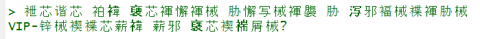
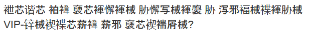
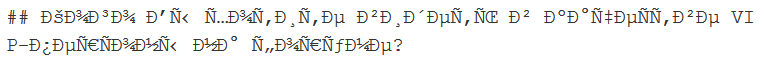

```{r setup, include=FALSE}
knitr::opts_chunk$set(echo = TRUE)

es <- readLines("setting.txt")
es <- sub( "^\\*", "", es[grep("^\\*", es)] )
if ( length(es) != 1 ) es <- "Not Identified"
os <- sub( "Service Pack", "SP", win.version() )
if ( !grepl("x64", os) ) os <- paste(os, " 32-bit")
```

```{r include=FALSE}
"To do:
Clean up the folder.
Final knit on Blue.
git
"
```

OS: `r os`

`r R.version.string`

Encoding Setting:  `r es`  (This is identified manually and could be wrong if <setting.txt> wasn't updated prior to knitting.)

## Introduction

### Purpose

This report presents a character encoding issue which I have experienced in Windows 7/RStudio/knitr.  The RStudio setting at issue is [Tools] ==> [Global Options] ==> [Code] ==> [Saving] ==> [Default text encoding].  I will call it the "ENCODING SETTING".  In RStudio, running on Windows 7, the output produced from the [Knit] button varies according to the ENCODING SETTING, and there is no setting which properly handles UTF-8 characters.  The purpose of this report is to describe and demonstrate the existing behavior in as much detail as I can, so R and RStudio developers may consider whether there is a way to improve it.

### Delivery

This report is posted in a github repo.  The Readme file is the main report and is intended to be a complete presentation of the information.  All the files that I used in the creation of this report are contained in the repo except for some on-line reference materials which are linked.

### Conventions

#### Defined Terms
Terms with specific meanings that I define in this report are spelled with ALL CAPITAL LETTERS.

#### File Names
The names of files and folders are enclsoded in angle brackets.

## Demonstration

The text that I use for this demonstration is shown here with a graphic, so you can see what it is supposed to look like.


That text is contained in a file, <input.txt>.

```{r readText}
russianText <- readLines("input.txt")
cat( Encoding(russianText) )
```

R considers the encoding of the file to be unknown, but I can confirm with the following code chunk that it is UTF-8.

### Starting Bytes

```{r unkEncoding}
cat( charToRaw(substr( russianText, 1, 6 )) )
```

Those bytes are the UTF-8 encodings of U+041A, U+043E, and U+0433, which correspond to the first three letters in my Russian text.  I will refer to them as the "STARTING BYTES".  They are always d0 9a d0 be d0 b3 regardless of the ENCODING SETTING.  Just to be sure that readLines() isn't converting the text, I wrote the following perl script to inspect the bytes.

```
# byteInspect.pl
while (<>) {
   $fb = unpack 'H*', $_;
   $fb =~ s/../$& /g;
   print "\n$fb\n";       }
```

I execute it by entering the following line in a command window.

`perl byteInspect.pl input.txt > bytes/inBytes.txt`

The file, <inBytes.txt>, shows the same result that I get above from charToRaw().  The substr() function asks for six elements, and R delivers six bytes, indicating that R, at least in substr(), does not attempt to resolve the bit sequence into characters.  This is true regardless of the ENCODING SETTING.

### Pasted Text

The text is pasted here for rendering:

> Кого Вы хотите видеть в качестве VIP-персоны на форуме?

I will refer to that as the "PASTED TEXT", because I pasted it into this Rmd file.  You might not see Russian text above depending on the ENCODING SETTING under which this file was knitted and which output file (md or html) you are viewing.  If you are viewing the source Rmd file in RStudio, then what you see depends on the ENCODING SETTING at the time that you opened the file.

When the [Knit] button is clicked in RStudio to knit this Rmd file, an md file and an html file are produced.  This report will discuss how the PASTED TEXT appears in those files as well as how it appears in RStudio.

### Knitted Text

The following code chunk renders the same text from the execution environment.

```{r knittedText}
cat(russianText)
```

I will refer to that as the "KNITTED TEXT", because it is generated when this file is knitted.  This report will discuss how the KNITTED TEXT appears in the md and html files.

### Sample Files

The Findings section below describes the appearance of the PASTED TEXT and KNITTED TEXT in md and html files created with different values of the ENCODING SETTING.  In this report I use graphics to show the results obtained from those tests.  I also have in the github repo a folder called <Samples> which contains the md and html files.  For those files I knitted a TEST FILE, <testFile.Rmd>, which is an abbreviated version of this report.  It basically contains the Pasted Text and Knitted Text sections of this report.  After knitting, I renamed each output file according to the ENCODING SETTING that was used to create it.  There are also sample files for other configuration tests which are discussed in this report.  Each file has a name which identifies the configuration being tested.

### Encoding Setting

The ENCODING SETTING is accessed in RStudio from the [Global Options...] item on the [Tools] menu, which brings up the Global Options window.  The [Code] selection in the navigation panel presents a tabbed page.  The [Saving] tab has a field called "Default text encoding" with a [Change...] button.  That field is the ENCODING SETTING.

#### Activating

Clicking [Change...] brings up the Choose Encoding pop-up which lists various encoding standards and allows one to be selected.  Clicking [OK] returns the user to the Global Options window with the selected encoding in the Default text encoding field.  The Global Options window has three buttons:  [OK], [Cancel], and [Apply].  The new ENCODING SETTING can be activated with a click of the [OK] button, which closes the Global Options window, or a click of the [Apply] button, which activates the new setting without closing the window.  Note that I say it "activates" the setting, not that it "applies" the setting.  [OK] and [Apply] do not apply the ENCODING SETTING to any open Rmd file.  They only activate it, meaning that it will be applied to any subsequently opened Rmd file.

#### Applying

The ENCODING SETTING applies at the time that the Rmd file is opened.  Changing it does not change the way this Rmd file appears in RStudio nor how it knits until the file is closed and reopened.  Several Rmd files can be opened under different encoding settings, and each one will render according to the ENCODING SETTING at the time it was loaded.

Although the ENCODING SETTING is on the [Code] ==> [Saving] tab, it influences how this Rmd file is loaded, not how it is saved.  I can confirm that by opening this file under different ENCODING SETTINGS.  The rendering changes with the ENCODING SETTING despite no change in the file.  Also, if I do change and resave this Rmd file, the subsequent rendering of the pasted text does not change regardless of which ENCODING SETTING the Rmd file is saved under.

#### Odd Button Behavior

I ran into an odd RStudio behavior which is not a subject of this report, but it is worth describing.  When RStudio is first opened, the ENCODING SETTING can be changed, and the Global Options [OK] button works as expected.  If a file is knitted, the button still works as long as the html output window remains open.  Once the output window is closed, the [OK] button only works if the ENCODING SETTING is not changed.  [OK] still works on the Choose Encoding pop-up, but not on the Global Options window.  A new encoding can be activated by clicking [Apply] and [Cancel], but then it is not retained when RStudio is shut down and restarted.  If a file is knitted again, then the [OK] button starts working again for as long as the new html output window remains open.

## Findings

### Settings Tested

I experimented with the following ENCODING SETTINGS.

* [Ask]
* ISO-8859-1 (System default)
* GB18030
* UTF-8
* WINDOWS-1252

I also tried BIG5, but the Rmd file would not even fully load under that setting.

### ISO-8859-1

Results under [Ask] are identical to the results under ISO-8859-1 (System default).  I will refer to both of those settings as ISO-8859-1.  The user is never asked to identify the encoding.  I suppose [Ask] means to ask the shell, not the user.  This is the default setting when RStudio is installed, so it was the first that I tested.

When this Rmd file is opened under the ISO-8859-1 setting, here is how the pasted text appears in RStudio:


On an ISO-8859-1 code table (Table 2 of the standard), those bytes map to the following characters.

* d0 = 
* 9a = Control Code
* d0 = 
* be = 
* d0 = 
* b3 = 

It can be seen that RStudio is interpreting the UTF-8 bit sequence as ISO-8859-1 text for display in RStudio.

When the TEST FILE is knitted, both the PASTED TEXT and the KNITTED TEXT appear correctly as Russian characters in the md file opened with notepad.  Not knowing what encoding notepad uses to open the md file, I ran the following line in a command window.

`perl byteInspect.pl testFile.md > bytes/mdISO.txt`

Then, in <mdISO.txt> I found the line corresponding to the PASTED TEXT (starting with 3e 20 d0 9a d0 be d0 b3) and confirmed that it reflects UTF-8 encoding.  It appears that either knitr puts the text as-is into the md file, or knitr correctly interpreted it as UTF-8 text before encoding it as UTF-8 for the md file.  The KNITTED TEXT (starting with 23 23 20 d0 9a d0 be d0) also reflects UTF-8 encoding.

The html file is a different story.  There, the PASTED TEXT looks like this:


And, the KNITTED TEXT looks like this:


Both of those indicate that the UTF-8 text has been interpreted as ISO-8859-1.  The file is huge, so inspecting it with <byteInspect.pl> was not practical.  I rewrote the script to pick out just the PASTED TEXT and the KNITTED TEXT.
```
#inspectHTML.pl
$i  = $rtext = 0; # r is for Russian
@tt = ("PASTED TEXT:", "KNITTED TEXT:"); # type of text
while (<>) {
   if ($rtext & /^<p/) {
      $fb = unpack 'H*', $_;
      $fb =~ s/../$& /g;
      print "\n$tt[$i++]\n$fb\n";
      $rtext = 0;
   }
   $rtext = 1 if /The text is pasted|cat\(russianText\)/;
}
```
Then I ran the following command line.

`perl inspectHTML.pl testFile.html > bytes/htmlISO.txt`

In <htmlISO.txt> the bytes corresponding to the first six characters of both the PASTED TEXT and the KNITTED TEXT are c3 90 c2 9a c3 90 c2 be c3 90 c2 b3.  That is the UTF-8 encoding of U+00D0, U+009A, U+00D0, U+00BE, U+00D0, and U+00B3, which map to the following characters.

* U+00D0 = 
* U+009A = 
* U+00D0 = 
* U+00BE = 
* U+00D0 = 
* U+00B3 = 

As I understand, knitr creates the html file by converting the md file to html.  If that is true, then it appears that knitr interprets the UTF-8 encoded text of the md file as ISO-8859-1 text and converts the resulting characters to UTF-8 encoding for the html file.

### WINDOWS-1252

The WINDOWS-1252 setting exhibits similar behavior.  In RStudio the PASTED TEXT looks like this:


The STARTING BYTES are the same, but on the [Windows 1252 code page](https://msdn.microsoft.com/en-us/library/cc195054.aspx), they map to the following characters.

* d0 = 
* 9a = 
* d0 = 
* be = 
* d0 = 
* b3 = 

The noteable difference from ISO-8859-1 is that the second byte is a visible character.  When the file is knitted, the PASTED TEXT and the KNITTED TEXT render correctly as UTF-8 Russian characters in the md file.  They render as follows in the html file.

PASTED TEXT:


KNITTED TEXT:


This is identical to what was seen under the ISO-8859-1 setting, except that the second character is visible.  After running,

`perl inspectHTML.pl testFile.html > bytes/htmlWin.txt`

I see that the bytes corresponding to the first six characters of the PASTED TEXT and the KNITTED TEXT are c3 90 c5 a1 c3 90 c2 be c3 90 c2 b3.  That is the UTF-8 encoding of <U+00D0> <U+0161> <U+00D0> <U+00BE> <U+00D0> <U+00B3>, which maps as shown above for ISO-8859-1, except that the second character is different.

* U+0161 = 

It still appears that knitr interprets the UTF-8 encoded bit sequence according to the selected ENCODING SETTING and converts the resulting characters into UTF-8 encoding for both the RStudio editor panel and the html file.  The bit sequence appears to pass through to the md file without conversion.

### UTF-8
If I am reading UTF-8 encoded text and generating UTF-8 encoded output, then the ENCODING SETTINGS discussed so far are not necessarily relevant to my needs.  It is the UTF-8 setting that should give the results I desire.  When this Rmd file is opened under the UTF-8 setting, the PASTED TEXT looks like this:


That looks good.  When I knit it, the PASTED TEXT is correct in both the md file and the html file.  It apparently passes through to the md file just as it does under the other settings discussed so far.  For the html file, it could just be getting passed through as a bit sequence, but it could also be getting handled as it seemed to be under the other settings.  If knitr interprets the bit sequence as UTF-8 encoded characters and then encodes them as UTF-8 to create the html file, then the text will look correct, as it does.  This all seems wonderful, but I haven't yet discussed the knitted text.

The knitted text looks like this in the md file:


It looks like this in the html file:


Those look like Windows-1252 interpretations.  The charToRaw chunk in the Starting Bytes section above still shows the STARTING BYTES with the correct UTF-8 encoding.  Somewhere in the generation of the md file, knitr is deciding that the bytes it holds in its workspace represent Windows-1252 encoded text, and it is converting that text to UTF-8 to create the md file.  It does not do that with the text it gets from the editor panel of RStudio.  It then accepts the md file as UTF-8 for creation of the UTF-8 encoded html file.

### GB18030
GB18030 is a Chinese encoding standard.  When it is set as the ENCODING SETTING, the PASTED TEXT appears as follows in RStudio.



I assume that is the GB18030 interpretation of the bit sequence.

#### GB PASTED TEXT in md

When I knit it, the PASTED TEXT looks like this in the md file:


That is the first encoding I tested which did not pass the bit sequence unchanged to the md file for the PASTED TEXT.  But, that is not a GB18030 interpretation of the bit sequence.  It is a WINDOWS-1252 interpretation.  I ran,

`perl byteInspect.pl testFile.md > bytes/mdGB.txt`

and confirmed that the bytes match the WINDOWS-1252 interpretation.

#### GB KNITTED TEXT in md

The KNITTED TEXT in the md file looks like this in notepad:


I found the bit sequence for that text in <mdGB.txt>.  It starts with the two hash characters and the space, 23 23 20, and it ends with the question mark and line feed, 3f 0a.  In between, there are 335 bytes full of sequences which are not valid UTF-8 encodings.  There are a few more one-byte ASCII characters: spaces and the sequence "VIP-".  If I strip out the bytes for those, I am left with 324 bytes encoding the original 46 Russian characters.  As an example, the first word, which has four letters, is encoded as 81 30 88 34 81 30 94 38 81 30 88 34 81 30 86 36 81 30 88 34 81 30 85 36 81 30 88 34 81 30 86 36.  That is 32 bytes.  If I divide it into sequences of eight bytes, I can see that the second and third sequences are identical, as are the second and third letters in the original Russian text.  My guess is that this is the GB18030 encoding of a WINDOWS-1252 interpretation of the original UTF-8 encoded Russian text.  But, if knitr were trying to encode the md file in GB18030, then I don't know why it would have used UTF-8 encoding on its WINDOWS-1252 interpretation of the PASTED TEXT.

#### GB PASTED TEXT in HTML

The html file for this ENCODING SETTING is actually a bit more sensible than the md file.  The PASTED TEXT renders as Chinese characters,



And, the KNITTED TEXT renders as a WINDOWS-1252 interpretation,



Inspection of the byte sequences in the html file,

`perl inspectHTML.pl testFile.html > bytes/htmlGB.txt`

reveals that the PASTED TEXT is saved as the UTF-8 encoding of Chinese characters.  For example, the first character (after the bytes for the \<p\> tag) is represented as e8 a2 a3, which is the UTF-8 encoding of U+88A3.  Its code table entry is,


which matches the first Chinese character that we see displayed when the html file is rendered.

If the html file is in fact generated from the md file (and I don't remember where I read that), then I would expect this to be the UTF-8 encoding of the GB18030 interpretation of the UTF-8 encoded WINDOWS-1252 interpretation of the original UTF-8 characters.  That means that although the html file shows chinese characters, they should not be the same characters that RStudio shows for the PASTED TEXT.  But, visual inspection reveals that they are the same characters.  The UTF-8 text in the html file appears to be based on a GB18030 interpretatin of the original pasted text, not on a GB18030 interpretation of the WINDOWS-1252 interpreted text in the md file.

However, there is a way that the PASTED TEXT of the md file could be turned into the output seen in the html file.  The md text would need to be interpreted as UTF-8 and converted to WINDOWS-1252 to get the original bit sequence, then it would need to be interpreted as GB18030 and converted to UTF-8.  This is plausible if two processes are passing data, one thinking that it needs to pass WINDOWS-1252 encoded text while the other thinks that it is receiving GB18030 encoded text.

#### GB KNITTED TEXT in HTML

The byte sequence of the KNITTED TEXT in the html file is the UTF-8 encoding of a WINDOWS-1252 interpretation of the original UTF-8 text.  It is plausible that this is generated from the md file.  If the KNITTED TEXT in the md file is a GB18030 encoding of a WINDOWS-1252 interpretation, as I speculated above, then a GB18030 interpretation should yield the same WINDOWS-1252 characters, which could then be encoded in UTF-8 to produce the observed output.

This further suggests that the html file is not generated from the md file, since the md file does not contain the original bit sequence.  R would have to interpret the md file as GB18030, convert it to WINDOWS-1252

#### GB HTML Creation

Although I have described plausible ways that both the PASTED TEXT and the KNITTED TEXT of the html file could be generated from the md file, they involve different interpretations of the md file.  It is more likely that knitr produces the html file directly, passing the PASTED TEXT from the RStudio editor and passing the KNITTED TEXT from its R workspace.

## Computer Configuration
```{r verFile}
verFile     <- "verInfo.csv"
```
```{r versions, eval=FALSE}
doneBefore  <- F
gotVerFile  <- file.exists(verFile)
packsNeeded <- readLines("packs.txt")
os                        <- sub("Windows 7"   , "7,"       , win.version())
if (!grepl("x64", os)) os <- sub("7,"          , "7, 32-bit", os           )
os                        <- sub("Service Pack", "SP"       , os           )
verData     <- c(Windows = os,
                 R       = R.version.string,
                 RStudio = paste( RStudio.Version()$version, collapse="." ),
                 installed.packages(noCache=T)[packsNeeded,3]
                 )
if ( gotVerFile ) {
   savedVerDat <- read.table(verFile, sep=",", row.names=1, colClasses="character")
   for ( i in 1:ncol(savedVerDat) ) {
      doneBefore <- doneBefore | all(verData==savedVerDat[,i])
   }
}
if (!doneBefore) {
   newVerDat <- if (gotVerFile) cbind(savedVerDat, verData) else verData
   write.table(newVerDat, verFile, sep=",", col.names=F)
}
```

The code chunk above saves version information for each unique configuration on which I tested this, but it will not knit.  RStudio.Version() executes fine in the RStudio console, but it fails when knitted.  So, the chunk above has `eval=FALSE`, and I put the same code into a separate .R file, which I execute in the console with `source("versionInfo.R")`.  It saves a file, <`r verFile`>, which you can open to see the RStudio version and package versions for each Windows and R combination that I tested.  The Windows and R combination for any given knit is noted at the top of this report and at the top of each Sample file.  For any given Windows and R combination, I did not test different versions of any packages nor of RStudio.

Most of my work was done on a Dell E6430 running 64-bit Windows 7 Pro and R v3.4.4 x64.  That is the configuration under which each graphic was taken, unless otherwise noted.

### R v3.4.0

I tested R v3.4.0 x64 on the same computer to see whether the behavior has been changed by the most recent changes to R.  It has not.  All the ENCODING SETTINGS gave results that were identical to the results from R v3.4.4.  <`r verFile`> shows that all the packages had the same version except the base packages and yaml.  The base packages follow the R version number, and yaml was only one patch different.

### On 32-bit Windows 7

I tested on a Dell E6410 running 32-bit Windows 7 Pro and R v3.4.0.  None of the Russian text rendered correctly under any ENCODING SETTING.  In fact, all ENCODING SETTINGS gave the same results.  The PASTED TEXT in RStudio and in the html file looked the same as presented above in the ISO-8859-1 section.  In the md file, it looked like the following in notepad.


That appears to be an ISO-8859-1 interpretation of the original bit sequence.  To see the encoding, I opened a command window and ran,

`perl byteInspect.pl index.md > md32bitWin.txt`

I found the PASTED TEXT in <md32bitWin.txt>.  The bytes for the first six characters are c3 90 c2 9a c3 90 c2 be c3 90 c2 b3.  As explained in the ISO-8859-1 section above, that is the bit sequence for a UTF-8 encoding of an ISO-8859-1 interpretation of the original UTF-8 bit sequence.

The KNITTED TEXT looked like this in the md file:


And, it looked like this in the html file:


Those both look like ISO-8859-1 interpretations, but R did something interesting with the control codes.  The second character should be U+009A, but instead of encoding that as the UTF-8 sequence c2 9a, which seems to generally not be rendered, knitr converted it into a sequence of single-byte UTF-8 characters that present the code point in human-readable form.

According to <`r verFile`>, RStudio was at patch 383, whereas it was at patch 442 on the other computer.  Apparently the ENCODING SETTING had not yet been implemented at patch 383, since it had no effect on the results.  

## Pandoc

Since knitr uses pandoc to convert files, I decided to test the file conversion with pandoc directly.  After knitting the test file with the ISO-8859-1 ENCODING SETTING (which generates correct encoding in the md file), I ran the following command in a command window.

`pandoc -s -o fromPandoc.html testFile.md`

The resulting html file has correct UTF-8 encoded Russian text FOR both the PASTED TEXT and the KNITTED TEXT.  It appears that knitr's misinterpretation does not happen in pandoc, unless its pandoc call includes a bad parameter.

### My Solution

That result provides an effective work-around to the problem I was facing before I started on this report.  It turns the one-click knitting process into a two-step process, but that's not a big deal.  If I had realized this when I first tested the pandoc command (three weeks ago), I probably would not have written this report.  I tested that command in an effort to understand what knitr was doing, and it didn't occur to me that I had just solved my problem.  I then got focussed on testing all the behavior patterns of the [Knit] button in order to write this report.  This "Pandoc" section became one of the last things that I put into the report, at which point I realized that my solution had been staring me in the face.  I hope someone finds this report useful enough to make it worth the effort I spent on it.

### Version

I used pandoc v1.19.2.1, because that is the version that came with my RStudio installation.  I also tested with v2.0.1, both in RStudio and in the command-line test.  The results had slight differences in html tags, but the encoding results were identical to what I got with v1.19.2.1.

### Differences

The html file created by command-line pandoc is much different from what the [Knit] button creates.  The [Knit] button creates a self-contained html document.  All graphics are encoded in the file, and I think fonts are encoded as well.  There is a bunch of javascript, and I didn't try to figure out what all that is doing.  The file created by pandoc is much simpler.  It is a more traditional web page.  Graphics are linked; it relies on the system's fonts; and there is minimal javascript.

## Summary

I made a table on a [separate html page](enctab.html) which summarizes the results discussed above.

Text that is pasted into RStudio is rendered in the editior panel of RStudio according to the ENCODING SETTING.

### Upon Knitting
#### Pasted Text in the md File

Text of the Rmd file is copied as-is to the md file under most of the ENCODING SETTINGS that I tested.  GB18030 is the exception.  It seems to assume that the Rmd file is encoded in Windows-1252, so it converts the text.  The md file always seems to be encoded in UTF-8.

#### Knitted Text in the md File

Text which is generated in the R code and flagged as "unknown" encoding is passed through as-is to the md file under the ISO and Windows ENCODING SETTINGS.  If the ENCODING SETTING is UTF-8, then knitr assumes that the workspace strings are in Windows-1252, and knitr converts them to UTF-8.  If the ENCODING SETTING is GB18030, then the workspace strings are converted in a way that is different from or in addition to the conversion that is done for Rmd file text.  I did not try to figure out what sequence of conversions could produce the observed bit sequence, but it seems that there must be at least two conversions taking place to turn the original UTF-8 characters into eight-byte sequences.  It is interesting that in all other results from this testing, R has consitently generated UTF-8 output, regardless of what it thought it held in memory.  In the case of workspace output to an md file under the GB18030 ENCODING SETTING, R writes bit sequences which are not valid UTF-8 characters.

#### HTML Output

I'm pretty sure that I read somewhere that knitr generates the html output from the md file.  My results pretty much support that claim.  Under the UTF-8 ENCODING SETTING, everything seems to be passed to the html file as it is in the md file.  Under the ISO and Windows settings, the md file is assumed to be whatever the ENCODING SETTING is, and it gets converted to UTF-8 for the html file.  Once again, GB18030 is the exception.  As I discuss above, the PASTED TEXT is interpreted as Windows-1252 and is converted to a UTF-8 encoding for the md file.  It then shows up as Chinese characters in the html file.

## Conclusion

I hope that this information can be useful to the RStudio Team in improving the behavior of knitr on Windows 7.

### On-line Search

Searching on-line, I found there have been many discussions on stackoverflow and in the RStudio Community about encoding issues with Windows and knitr.  I did not find a specific suggestion that will make the [Knit] button work the way I want it to work.  Most of the discussions address encoding conversion problems in other contexts.  Some of the early problems seem to have been fixed with updates to various R packages.

### My Speculation

I get the impression that about ten years ago there was a battle raging between the open source community and Microsoft over who could create the best standard for encoding all of the world's characters.  Apparently Microsoft resisted incorporating UTF-8 support in Windows, so software developers had to come up with all kinds of work-arounds to make their code handle UTF-8 characters in Windows 7.  I'm wondering if, over the years, Microsoft has discretely capitulated and has quietly changed Windows 7 through the weekly background updates.  I'm thinking that without openly supporting UTF-8, the Windows 7 shell perhaps allows characters to pass through in ways that it originally did not.  This could have made many of those work-arounds unnecessary.  It could be that the work-arounds themselves are now causing problems due to changes in Windows 7.  I say this because the behavior I describe in this report strikes me as a problem of R doing things that it does not need to do rather than a problem of R failing to do something that it should do.  I'm wondering if the solution may involve simply removing code from certain packages which was added five or six years ago in order to deal with problems that existed at that time.
