OS: Windows 7 x64 (build 7601) SP 1

R version 3.4.4 (2018-03-15)

Encoding Setting:  [Ask]  (This is identified manually and could be wrong if <setting.txt> wasn't updated prior to knitting.)

# Introduction

## Purpose

This report presents a character encoding issue which I have experienced in Windows 7/RStudio/knitr.  The RStudio setting at issue is [Tools] ==> [Global Options] ==> [Code] ==> [Saving] ==> [Default text encoding].  I will call it the "ENCODING SETTING".  In RStudio, running on Windows 7, the output produced from the [Knit] button varies according to the ENCODING SETTING, and there is no setting which properly handles UTF-8 characters.  The purpose of this report is to describe and demonstrate the existing behavior in as much detail as I can, so R and RStudio developers may consider whether there is a way to improve it.

## Delivery

This report is posted in a github repo.  The Readme file is the main report and is intended to be a complete presentation of the information.  All the files that I used in the creation of this report are contained in the repo except for some on-line reference materials which are linked.

## Conventions

### Defined Terms
Terms with specific meanings that I define in this report are spelled with ALL CAPITAL LETTERS.

### File Names
The names of files and folders are presented like |:file or folder name:|.  While writing most of this report, I was enclosing them in angle brackets, until I determined that angle brackets didn't work well.  There might be some that I failed to update after I changed the convention.

# Demonstration

The text that I use for this demonstration is shown here with a graphic, so you can see what it is supposed to look like.


That text is contained in a file, <input.txt>.


```r
russianText <- readLines("input.txt")
cat( Encoding(russianText) )
```

```
## unknown
```

R considers the encoding of the file to be unknown, but I can confirm with the following code chunk that it is UTF-8.

## Starting Bytes


```r
cat( charToRaw(substr( russianText, 1, 6 )) )
```

```
## d0 9a d0 be d0 b3
```

Those bytes are the UTF-8 encodings of U+041A, U+043E, and U+0433, which correspond to the first three letters in my Russian text.  I will refer to them as the "STARTING BYTES".  They are always d0 9a d0 be d0 b3 regardless of the ENCODING SETTING.  The decoding scheme is presented in section 3 of [RFC 3629](https://tools.ietf.org/html/rfc3629).  Just to be sure that readLines() isn't converting the text, I wrote the following perl script to inspect the bytes.

```
# byteInspect.pl
while (<>) {
   $fb = unpack 'H*', $_;
   $fb =~ s/../$& /g;
   print "\n$fb\n";       }
```

I executed it by entering the following line in a command window.

`perl byteInspect.pl input.txt > bytes/inBytes.txt`

The file, |:inBytes.txt:|, shows the same result that I get above from charToRaw().  The substr() function asks for six elements, and R delivers six bytes, indicating that R, at least in substr(), does not attempt to resolve the bit sequence into characters.  This is true regardless of the ENCODING SETTING.

## Pasted Text

The text is pasted here for rendering:

> Кого Вы хотите видеть в качестве VIP-персоны на форуме?

I will refer to that as the "PASTED TEXT", because I pasted it into this Rmd file.  You might not see Russian text above depending on the ENCODING SETTING under which this file was knitted and which output file (md or html) you are viewing.  If you are viewing the source Rmd file in RStudio, then what you see depends on the ENCODING SETTING at the time that you opened the file.  When the [Knit] button is clicked in RStudio to knit this Rmd file, an md file and an html file are produced.  This report will discuss how the PASTED TEXT appears in those files as well as how it appears in RStudio.

## Knitted Text

The following code chunk renders the same text from the execution environment.


```r
cat(russianText)
```

```
## Кого Вы хотите видеть в качестве VIP-персоны на форуме?
```

I will refer to that as the "KNITTED TEXT", because it is generated when this file is knitted.  This report will discuss how the KNITTED TEXT appears in the md and html files.

## Sample Files

The Findings section below describes the appearance of the PASTED TEXT and KNITTED TEXT in md and html files created with different values of the ENCODING SETTING.  In this report I use graphics to show the results obtained from those tests.  I also have in the github repo a folder called |:Samples:| which contains the md and html files.  For those files I knitted a TEST FILE, |:testFile.Rmd:|, which is an abbreviated version of this report.  It basically contains the Pasted Text and Knitted Text sections of this report.  After knitting, I renamed each output file according to the ENCODING SETTING that was used to create it and moved it to |:Samples:|.

## Encoding Setting

The ENCODING SETTING is accessed in RStudio from the [Global Options...] item on the [Tools] menu, which brings up the Global Options window.  The [Code] selection in the navigation panel presents a tabbed page.  The [Saving] tab has a field called "Default text encoding" with a [Change...] button.  That field is the ENCODING SETTING.

### Activating

Clicking [Change...] brings up the Choose Encoding pop-up which lists various encoding standards and allows one to be selected.  Clicking [OK] returns the user to the Global Options window with the selected encoding in the Default text encoding field.  The Global Options window has three buttons:  [OK], [Cancel], and [Apply].  The new ENCODING SETTING can be activated with a click of the [OK] button, which closes the Global Options window, or a click of the [Apply] button, which activates the new setting without closing the window.  Note that I say it "activates" the setting, not that it "applies" the setting.  [OK] and [Apply] do not apply the ENCODING SETTING to any open Rmd file.  They only activate it, meaning that it will be applied to any subsequently opened Rmd file.

### Applying

The ENCODING SETTING applies at the time that the Rmd file is opened.  Changing it does not change the way this Rmd file appears in RStudio nor how it knits until the file is closed and reopened.  Several Rmd files can be opened under different encoding settings, and each one will render according to the ENCODING SETTING at the time it was loaded.  Although the ENCODING SETTING is on the [Code] ==> [Saving] tab, it influences how this Rmd file is loaded, not how it is saved.  I confirmed that by opening this file under different ENCODING SETTINGS.  The rendering changes with the ENCODING SETTING despite no change in the file.  Also, if I do change and resave this Rmd file, the subsequent rendering of the PASTED TEXT does not change regardless of which ENCODING SETTING the Rmd file was saved under.

### Odd Button Behavior

I ran into an odd RStudio behavior which is not a subject of this report, but it is worth describing.  When RStudio is first opened, the ENCODING SETTING can be changed, and the Global Options [OK] button works as expected.  If a file is knitted, the button still works as long as the html output window remains open.  Once the output window is closed, the [OK] button only works if the ENCODING SETTING is not changed.  [OK] still works on the Choose Encoding pop-up, which only submits the change to the Global Options window, but it does not work on the Global Options window, which is what activates the change.  A new encoding can be activated by clicking [Apply] and [Cancel], but then it is not retained when RStudio is shut down and restarted.  If a file is knitted again, then the [OK] button starts working again for as long as the new html output window remains open.

# Findings

## Settings Tested

I experimented with the following ENCODING SETTINGS.

* [Ask]
* ISO-8859-1 (System default)
* GB18030
* UTF-8
* WINDOWS-1252

I also tried BIG5, but the Rmd file would not even fully load under that setting.

### ISO-8859-1

Results under [Ask] are identical to the results under ISO-8859-1 (System default).  I will refer to both of those settings as ISO-8859-1.  The user is never asked to identify the encoding.  I suppose [Ask] means to ask the shell, not the user.  This is the default setting when RStudio is installed, so it was the first that I tested.

When this Rmd file is opened under the ISO-8859-1 setting, here is how the pasted text appears in RStudio:


On an ISO-8859-1 code table (Table 2 of [the standard](http://std.dkuug.dk/JTC1/sc2/wg3/docs/n411.pdf)), the STARTING BYTES map to the following characters.

* d0 = 
* 9a = Control Code
* d0 = 
* be = 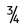
* d0 = 
* b3 = 

It can be seen that RStudio is interpreting the UTF-8 bit sequence as ISO-8859-1 text for display in RStudio.

When the TEST FILE is knitted, both the PASTED TEXT and the KNITTED TEXT appear correctly as Russian characters in the md file opened with notepad.  Not knowing what encoding notepad uses to open the md file, I ran the following line in a command window.

`perl byteInspect.pl testFile.md > bytes/ISOmd.txt`

Then, in |:ISOmd.txt:| I found the line corresponding to the PASTED TEXT (starting with 3e 20 d0 9a d0 be d0 b3) and confirmed on the [Unicode v10 Code Charts](https://www.unicode.org/Public/10.0.0/charts/CodeCharts.pdf) that it reflects UTF-8 encoding.  It appears that either knitr puts the text as-is into the md file, or knitr correctly interpreted it as UTF-8 text before encoding it as UTF-8 for the md file.  The KNITTED TEXT (starting with 23 23 20 d0 9a d0 be d0) also reflects UTF-8 encoding.

The html file is a different story.  There, the PASTED TEXT looks like this:

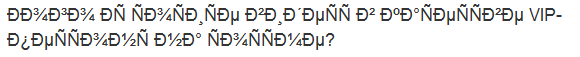

And, the KNITTED TEXT looks like this:


Both of those indicate that the UTF-8 text has been interpreted as ISO-8859-1.  The file is huge, so inspecting it with <byteInspect.pl> was not practical.  I rewrote the script to pick out just the PASTED TEXT and the KNITTED TEXT.
```
#inspectHTML.pl
$i  = $rtext = 0; # r is for Russian
@tt = ("PASTED TEXT:", "KNITTED TEXT:"); # type of text
while (<>) {
   if ($rtext & /^<p/) {
      $fb = unpack 'H*', $_;
      $fb =~ s/../$& /g;
      print "\n$tt[$i++]\n$fb\n";
      $rtext = 0;
   }
   $rtext = 1 if /The text is pasted|cat\(russianText\)/;
}
```
Then I ran the following command line.

`perl inspectHTML.pl testFile.html > bytes/ISOhtml.txt`

In <htmlISO.txt> the bytes corresponding to the first six characters of both the PASTED TEXT and the KNITTED TEXT are c3 90 c2 9a c3 90 c2 be c3 90 c2 b3.  That is the UTF-8 encoding of U+00D0, U+009A, U+00D0, U+00BE, U+00D0, and U+00B3, which map to the following characters.

* U+00D0 = 
* U+009A = 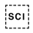
* U+00D0 = 
* U+00BE = 
* U+00D0 = 
* U+00B3 = 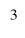

As I understand, knitr creates the html file by converting the md file to html.  If that is true, then it appears that knitr interprets the UTF-8 encoded text of the md file as ISO-8859-1 text and converts the resulting characters to UTF-8 encoding for the html file.

### WINDOWS-1252

The WINDOWS-1252 setting exhibits similar behavior.  In RStudio the PASTED TEXT looks like this:


The STARTING BYTES are the same, but on the [Windows 1252 code page](https://msdn.microsoft.com/en-us/library/cc195054.aspx), they map to the following characters.

* d0 = 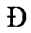
* 9a = 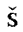
* d0 = 
* be = 
* d0 = 
* b3 = 

The noteable difference from ISO-8859-1 is that the second byte is a visible character.  When the file is knitted, the PASTED TEXT and the KNITTED TEXT render correctly as UTF-8 Russian characters in the md file.  They render as follows in the html file.

PASTED TEXT:


KNITTED TEXT:

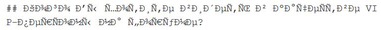

This is identical to what was seen under the ISO-8859-1 setting, except that the second character is visible.  After running,

`perl inspectHTML.pl testFile.html > bytes/winhtml.txt`

I see that the bytes corresponding to the first six characters of the PASTED TEXT and the KNITTED TEXT are c3 90 c5 a1 c3 90 c2 be c3 90 c2 b3.  That is the UTF-8 encoding of U+00D0 U+0161 U+00D0 U+00BE U+00D0 U+00B3 (disregard spaces), which maps as shown above for ISO-8859-1, except that the second character is different.

* U+0161 = 

It still appears that knitr interprets the UTF-8 encoded bit sequence according to the selected ENCODING SETTING and converts the resulting characters into UTF-8 encoding for both the RStudio editor panel and the html file.  The bit sequence appears to pass through to the md file without conversion.

### UTF-8
If I am reading UTF-8 encoded text and generating UTF-8 encoded output, then the ENCODING SETTINGS discussed so far are not necessarily relevant to my needs.  It is the UTF-8 setting that should give the results I desire.  When this Rmd file is opened under the UTF-8 setting, the PASTED TEXT looks like this:

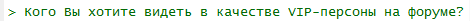

That looks good.  When I knit it, the PASTED TEXT is correct in both the md file and the html file.  It apparently passes through to the md file just as it does under the other settings discussed so far.  For the html file, it could just be getting passed through as a bit sequence, but it could also be getting handled as it seemed to be under the other settings.  If knitr interprets the bit sequence as UTF-8 encoded characters and then encodes them as UTF-8 to create the html file, then the text will look correct, as it does.  This all seems wonderful, but I haven't yet discussed the knitted text.

The knitted text looks like this in the md file:


It looks like this in the html file:


Those look like Windows-1252 interpretations.  The charToRaw chunk in the Starting Bytes section above still shows the STARTING BYTES with the correct UTF-8 encoding.  Somewhere in the generation of the md file, knitr is deciding that the bytes it holds in its workspace represent Windows-1252 encoded text, and it is converting that text to UTF-8 to create the md file.  It does not do that with the text it gets from the editor panel of RStudio.  It then accepts the md file as UTF-8 for creation of the UTF-8 encoded html file.

### GB18030
GB18030 is a Chinese encoding standard.  When it is set as the ENCODING SETTING, the PASTED TEXT appears as follows in RStudio.


I assume that is the GB18030 interpretation of the bit sequence.

#### GB PASTED TEXT in md

When I knit it, the PASTED TEXT looks like this in the md file:


That is the first encoding I tested which did not pass the bit sequence unchanged to the md file for the PASTED TEXT.  But, that is not a GB18030 interpretation of the bit sequence.  It is a WINDOWS-1252 interpretation.  I ran,

`perl byteInspect.pl testFile.md > bytes/GBmd.txt`

and confirmed that the bytes match the WINDOWS-1252 interpretation.

#### GB KNITTED TEXT in md

The KNITTED TEXT in the md file looks like this in notepad:


I found the bit sequence for that text in <mdGB.txt>.  It starts with the two hash characters and the space, 23 23 20, and it ends with the question mark and line feed, 3f 0a.  In between, there are 335 bytes full of sequences which are not valid UTF-8 encodings.  There are a few more one-byte ASCII characters: spaces and the sequence "VIP-".  If I strip out the bytes for those, I am left with 324 bytes encoding the original 46 Russian characters.  As an example, the first word, which has four letters, is encoded as 81 30 88 34 81 30 94 38 81 30 88 34 81 30 86 36 81 30 88 34 81 30 85 36 81 30 88 34 81 30 86 36.  That is 32 bytes.  If I divide it into sequences of eight bytes, I can see that the second and third sequences are identical, as are the second and third letters in the original Russian text.  My guess is that this is the GB18030 encoding of a WINDOWS-1252 interpretation of the original UTF-8 encoded Russian text.  But, if knitr were trying to encode the md file in GB18030, then I don't know why it would have used UTF-8 encoding on its WINDOWS-1252 interpretation of the PASTED TEXT.

#### GB PASTED TEXT in HTML

The html file for this ENCODING SETTING is actually a bit more sensible than the md file.  The PASTED TEXT renders as Chinese characters,


And, the KNITTED TEXT renders as a WINDOWS-1252 interpretation,


Inspection of the byte sequences in the html file,

`perl inspectHTML.pl testFile.html > bytes/GBhtml.txt`

reveals that the PASTED TEXT is saved as the UTF-8 encoding of Chinese characters.  For example, the first character (after the bytes for the \<p\> tag) is represented as e8 a2 a3, which is the UTF-8 encoding of U+88A3.  Its code table entry is,

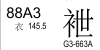

which matches the first Chinese character that we see displayed when the html file is rendered.

If the html file is in fact generated from the md file (and I don't remember where I read that), then I would expect this to be the UTF-8 encoding of the GB18030 interpretation of the UTF-8 encoded WINDOWS-1252 interpretation of the original UTF-8 characters.  That means that although the html file shows chinese characters, they should not be the same characters that RStudio shows for the PASTED TEXT.  But, visual inspection reveals that they are the same characters.  The UTF-8 text in the html file appears to be based on a GB18030 interpretatin of the original pasted text, not on a GB18030 interpretation of the WINDOWS-1252 interpreted text in the md file.

However, there is a way that the PASTED TEXT of the md file could be turned into the output seen in the html file.  The md text would need to be interpreted as UTF-8 and converted to WINDOWS-1252 to get the original bit sequence, then it would need to be interpreted as GB18030 and converted to UTF-8.  This is plausible if two processes are passing data, one thinking that it needs to pass WINDOWS-1252 encoded text while the other thinks that it is receiving GB18030 encoded text.

#### GB KNITTED TEXT in HTML

The byte sequence of the KNITTED TEXT in the html file is the UTF-8 encoding of a WINDOWS-1252 interpretation of the original UTF-8 text.  It is plausible that this is generated from the md file.  If the KNITTED TEXT in the md file is a GB18030 encoding of a WINDOWS-1252 interpretation, as I speculated above, then a GB18030 interpretation should yield the same WINDOWS-1252 characters, which could then be encoded in UTF-8 to produce the observed output.

#### GB HTML Creation

Although I have described plausible ways that both the PASTED TEXT and the KNITTED TEXT of the html file could be generated from the md file, they involve different interpretations of the md file.  It is more likely that knitr produces the html file directly, passing the PASTED TEXT from the RStudio editor and passing the KNITTED TEXT from its execution environment.

## Other R Versions

The version of R used by RStudio can be selected at [Tools] ==> [Global Options] ==> [General] ==> [R version:].  All the work reported above was done with 64-bit R v3.4.4.  I also tested all the ENCODING SETTINGS with 32-bit R v3.4.4, 64-bit R v3.4.0, and 32-bit R v3.4.0.  The results were identical to what is reported above.  In R v3.4.0 all the packages had the same version as in R v3.4.4 except the base packages, which follow the R version number.  In R v3.4.4, the 32-bit and 64-bit builds share the same library.

## On 32-bit Windows 7

All the work reported above was done on a Dell E6430 running 64-bit Windows 7 Pro and RStudio v1.1.442.  I also tested on a Dell E6410 running 32-bit Windows 7 Pro.  Initially I just used RStudio as it was, which was v1.1.383.  When that gave me what I consider useless results (discussed below), I upgraded to v1.1.442 to match what I had on the other computer.

### RStudio v1.1.442 and R v3.4.4

With RStudio v1.1.442 and R v3.3.4, I got the same results as on the 64-bit Windows.

### RStudio v1.1.442 and R v3.4.0

With R switched to R v3.4.0 on the 32-bit win7 machine, I was surprised to find that I got different results.  The following sections describe what each ENCODING SETTING gave me on 32-bit Windows 7 Pro, RStudio v1.1.442, R v3.4.0.  In each case, the text in RStudio rendered according to the ENCODING SETTING, so I will only address the results in the knitr output files.

#### ISO-8859-1 on 32-bit win7 with R v3.4.0

The PASTED TEXT looked like an ISO-8859-1 interpretation in both the md file and the html file.

md file:

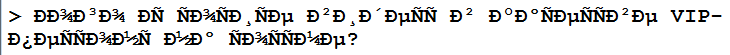

html file:

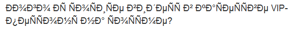

That is the same result in the html file that was seen for that setting on the 64-bit Windows, but the md file had reflected a UTF-8 interpretation.  To see the encoding, I opened a command window and ran,

`perl byteInspect.pl testFile.md > bytes/win32bit-R340/ISOmd.txt`

I found the PASTED TEXT in <ISOmd.txt>.  The bytes for the first six characters are c3 90 c2 9a c3 90 c2 be c3 90 c2 b3.  That is the bit sequence for a UTF-8 encoding of an ISO-8859-1 interpretation of the original UTF-8 bit sequence.

The KNITTED TEXT also looked like ISO-8859-1 interpretations in both the md file and the html file, but R did something interesting with the control codes.  The second character should be U+009A, but instead of encoding that as the UTF-8 sequence c2 9a, which seems to generally not be rendered, knitr converted it into a sequence of single-byte UTF-8 characters that present the code point in human-readable form.  Several other control code characters were also handled that way.

md file:

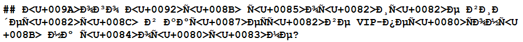

html file:

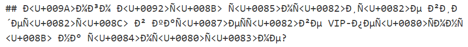

The results with the ENCODING SETTING on [Ask] were identical to the ISO-8859-1 results.

#### WINDOWS-1252 on 32-bit win7 with R v3.4.0

The PASTED TEXT looks like this in the md file:

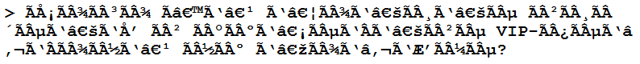

and this in the html file:

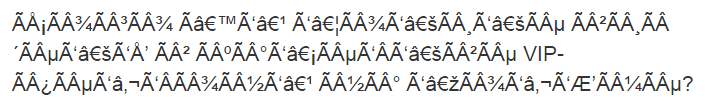

These are identical, but they are full of characters that had not yet been observed in these tests.  I ran the perl scripts to put the byte sequence files into <bytes/win32bit-R340/>.  In both the md and html output, the first 24 bytes of the PASTED TEXT are c3 83 c2 90 c3 85 c2 a1 c3 83 c2 90 c3 82 c2 be c3 83 c2 90 c3 82 c2 b3.  They encode the rendered text in UTF-8 as shown below, which matches the first nine visible characters, the DCS being unrendered.

* c3 83 = U+00C3 = 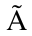
* c2 90 = U+0090 = 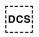 = Device Control String
* c3 85 = U+00C5 = 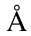
* c2 a1 = U+00A1 = 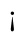
* c3 83 = U+00C3 = 
* c2 90 = U+0090 =  = Device Control String
* c3 82 = U+00C2 = 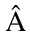
* c2 be = U+00BE = 
* c3 83 = U+00C3 = 
* c2 90 = U+0090 =  = Device Control String
* c3 82 = U+00C2 = 
* c2 b3 = U+00BE = 

Those characters, if encoded in Windows-1252, would be, c3 ?? c5 a1 c3 ?? c2 be c3 ?? c2 b3.  I use ?? for the DCS, because Windows-1252 does not define a DCS character.  However, it does identify several byte values as "Not Used", including 90.  If we assume that knitr derived the DCS characters from that bit sequence, then knitr would have been interpreting c3 90 c5 a1 c3 90 c2 be c3 90 c2 b3 as Windows-1252.  We see from the first WINDOW-1252 discussion above, that this is the bit sequence for the UTF-8 encoding of a Windows-1252 interpretation of the original bit sequence.  So, it seems that our UTF-8 Russian text is interpreted as Windows-1252, then encoded in UTF-8 for passing between two processes, but interpreted by the receiving process as Windows-1252 text, and converted to UTF-8 for output to the md and html files.

The KNITTED TEXT looks like this in the md file:

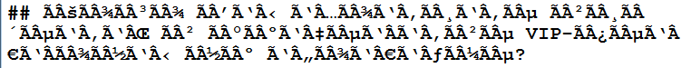

and this in the html file:

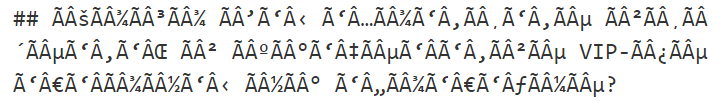

If the UTF-8 encoded Russian text is interpreted as ISO-8859-1 and converted to UTF-8, then the beginning of the bit sequence would be c3 90 c2 9a c3 90 c2 be c3 90 c2 b3, as discussed in the ISO-8859-1 sections above.  If that is interpreted as Windows-1252 and converted to UTF-8, the result is what was just discussed for the PASTED TEXT, except that the third and fourth bytes would be c2 9a instead of c5 a1.  Interpreting those as Windows-1252 results in the following characters.

* c2 = 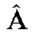
* 9a = 

That matches the second and third displayed characters in the KNITTED TEXT, and the rest of the characters are identical to their couterparts in the PASTED TEXT.  So, it seems that the KNITTED TEXT is interpreted as ISO-8859-1, then encoded in UTF-8 for passing between two processes, but interpreted by the receiving process as Windows-1252 text, and converted to UTF-8 for output to the md and html files.

#### UTF-8 on 32-bit win7 with R v3.4.0

The PASTED TEXT was correctly encoded as Russian characters in both the md and html files.  The KNITTED TEXT is interpreted as ISO-8859-1 for both files.  The rendering and analysis of ISO-8859-1 interpretted text is shown and discussed above, so that discussion will not be repeated here.

#### GB10830 on 32-bit win7 with R v3.4.0

The html file is identical to what is produced under R v3.4.4, but the md file is different.  In the md file, the PASTED TEXT renders as Chinese characters,

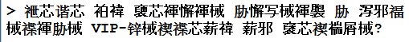

The KNITTED TEXT is interpreted as ISO-8859-1 in the same way as previously presented and discussed.

Visual inspection of the files and comparison of the byte sequences show that both sets of text are identical between the two files.  This indicates that either knitr directly copied the byte sequences from the md file to the html file, or knitr used identical interpretations and encodings to generate the two files.

### RStudio v1.1.383

When I initially ran my 32-bit Windows tests, it was with RStudio v1.1.383 and R v3.4.0.  All ENCODING SETTINGS gave the same results as the ISO-8859-1 setting with RStudio v1.1.442 and R v3.4.0.  Getting all identical results indicated that the ENCODING SETTINGS was not yet implemented in RStudio v1.1.383.  I figure that does not say much about on how knitr now handles encoding, with the setting implemented, so that information is probably not very useful.

## Computer Configuration

For any given knit, the Windows version and R version are noted at the top of this report and at the top of each Sample file.  The code chunk below was written to record that information, plus the RStudio version and the versions of all the packages that I determined to be required for these experiments.


```r
verFile     <- "versionInfo.csv"
```

```r
doneBefore  <- F
gotVerFile  <- file.exists(verFile)
packsNeeded <- readLines("packs.txt")
os                        <- sub("Windows 7"   , "7,"       , win.version())
if (!grepl("x64", os)) os <- sub("7,"          , "7, 32-bit", os           )
os                        <- sub("Service Pack", "SP"       , os           )
verData     <- c(Windows = os,
                 R       = sub("R version ", "", R.version.string),
                 RStudio = paste( RStudio.Version()$version, collapse="." ),
                 installed.packages(noCache=T)[packsNeeded,3]
                 )
if ( gotVerFile ) {
   savedVerDat <- read.table(verFile, sep=",", row.names=1, colClasses="character")
   for ( i in 1:ncol(savedVerDat) ) {
      doneBefore <- doneBefore | all(verData==savedVerDat[,i])
   }
}
if (!doneBefore) {
   newVerDat <- if (gotVerFile) cbind(savedVerDat, verData) else verData
   write.table(newVerDat, verFile, sep=",", col.names=F)
}
```

Unfortunately, that code chunk will not knit.  RStudio.Version() executes fine in the RStudio console, but it fails when knitted.  So, the chunk above has `eval=FALSE`, and I put the same code into a separate .R file, which I execute in the console with `source("versionInfo.R")`.  It saves a file, <versionInfo.csv>, which you can open to see the version information for each configuration that I tested.

## Pandoc

Since knitr uses pandoc to convert files, I decided to test the file conversion with pandoc directly.  After knitting the test file with the ISO-8859-1 ENCODING SETTING (which generates correct encoding in the md file), I ran the following command in a command window.

`pandoc -s -o fromPandoc.html testFile.md`

The resulting html file has correct UTF-8 encoded Russian text FOR both the PASTED TEXT and the KNITTED TEXT.  It appears that knitr's misinterpretation does not happen in pandoc, unless its pandoc call includes a bad parameter.

### My Solution

That result provides an effective work-around to the problem I was facing before I started on this report.  It turns the one-click knitting process into a two-step process, but that's not a big deal.  If I had realized this when I first tested the pandoc command (three weeks ago), I probably would not have written this report.  I tested that command in an effort to understand what knitr was doing, and it didn't occur to me that I had just solved my problem.  I then got focussed on testing all the behavior patterns of the [Knit] button in order to write this report.  This "Pandoc" section became one of the last things that I put into the report, at which point I realized that my solution had been staring me in the face.  I hope someone finds this report useful enough to make it worth the effort I spent on it.

### Version

I used pandoc v1.19.2.1, because that is the version that came with my RStudio installation.  I also tested with v2.0.1, both in RStudio and in the command-line test.  The results had slight differences in html tags, but the encoding results were identical to what I got with v1.19.2.1.

### Differences

The html file created by command-line pandoc is much different from what the [Knit] button creates.  The [Knit] button creates a self-contained html document.  All graphics are encoded in the file, and I think fonts are encoded as well.  There is a bunch of javascript, and I didn't try to figure out what all that is doing.  The file created by pandoc is much simpler.  It is a more traditional web page.  Graphics are linked; it relies on the system's fonts; and there is minimal javascript.

## Summary

I wrote a [separate html file](ResultsTable.html), ResultsTable.html, with tables that summarize the results.  In this summary, I will disregard the results with RStudio v1.1.383, since that just seems to default the behavior to the ISO-8859-1 setting.

### RStudio Display

Text that is pasted into the Rmd file is always rendered in the editior panel of RStudio v1.1.442 according to the ENCODING SETTING.

### Most Common Results

In the knitted output files, all of the R versions had the same results on the 64-bit Windows machine.  Under the Windows oriented ENCODING SETTINGS, ISO-8859-1 and WINDOWS-1252 the text was treated identically whether it originated from the Rmd file or was read into the execution environment by R code.  The differences were between the two output files.  The text was passed to the md file as-is, whereas it was converted according to the ENCODING SETTING for the html file.  With the UTF-8 setting, the text was treated identically across the two files, but differently according to its source.  The text from the Rmd file was unchanged, while the read-in text was interpreted as Windows-1252 text.  With the GB18030 setting, all text was interpreted as Windows-1252 except when sourced from the Rmd file for html output, in which case it was interpreted as GB18030.  Additionally, the text read into the execution environment was converted to something other than UTF-8 (probably GB18030) for the md file.

### R v3.4.0 on 32-bit Windows

When I tested with R v3.4.0 on the 32-bit Windows I got different results, but the R and Windows configuration was not the only difference.  The following nine packages were at older versions.

* backports
* digest
* knitr
* Rcpp
* rmarkdown
* rprojroot
* stringi
* stringr
* yaml

Of course, problem reports should not be done with old packages, but I am not so much trying to report a problem as trying to provide clues for solving a problem that is well known to have existed for a long time.  With that in mind, the differences between the old an new behavior may be instructive.

With the ISO-8859-1 setting, the text was always interpreted as ISO-8859-1, but it was converted to UTF-8 in different ways for the two files.  The md file just had a straight conversion, whereas control codes were transformed into human readable tags for the html file.  With the other settings, the output depended on the source of the text.  The text from the Rmd file was interpreted according to the ENCODING SETTING.  The read-in text was interpreted as Windows-1252 under the GB18030 setting and as ISO-8859-1 under the UTF-8 and WINDOWS-1252 settings.  Additionally, with the WINDOWS-1252 setting, all text (both from the Rmd file and read-in) was internally converted to UTF-8, then interpreted again as Windows-1252 before being converted to UTF-8 for output.

## Conclusion

I hope that this information can be useful to the RStudio Team in improving the behavior of knitr on Windows 7.

### On-line Search

Searching on-line, I found there have been many discussions on stackoverflow and in the RStudio Community about encoding issues with Windows and knitr.  I did not find a specific suggestion that will make the [Knit] button work the way I want it to work.  Most of the discussions address encoding conversion problems in other contexts.  Some of the early problems seem to have been fixed with updates to various R packages.

### My Speculation

I get the impression that about ten years ago there was a battle raging between the open source community and Microsoft over who could create the best standard for encoding all of the world's characters.  Apparently Microsoft resisted incorporating UTF-8 support in Windows, so software developers had to come up with all kinds of work-arounds to make their code handle UTF-8 characters in Windows 7.  I'm wondering if, over the years, Microsoft has discretely capitulated and has quietly changed Windows 7 through the weekly background updates.  I'm thinking that without openly supporting UTF-8, the Windows 7 shell perhaps allows characters to pass through in ways that it originally did not.  This could have made many of those work-arounds unnecessary.  It could be that the work-arounds themselves are now causing problems due to changes in Windows 7.  I say this because the behavior I describe in this report strikes me as a problem of R doing things that it does not need to do rather than a problem of R failing to do something that it should do.  I'm wondering if the solution may involve simply removing code from certain packages which was added five or six years ago in order to deal with problems that existed at that time.

### Further Work

I will do more testing to see which of the nine packages influences the encoding behavior.  Also, I see that R v3.5.0 was released shortly after I started working on this report.  I will need to test with that and see if things are any better.  Those tests will have to wait, though, because I have other things to do.  I will update this report on github whenever I do additional testing.

### Linux

I've been wanting to switch to Linux for over a decade but just haven't gotten around to it.  Perhaps it is time to make the leap.  In the time it took me to write this report, I could have become a Linux master.
